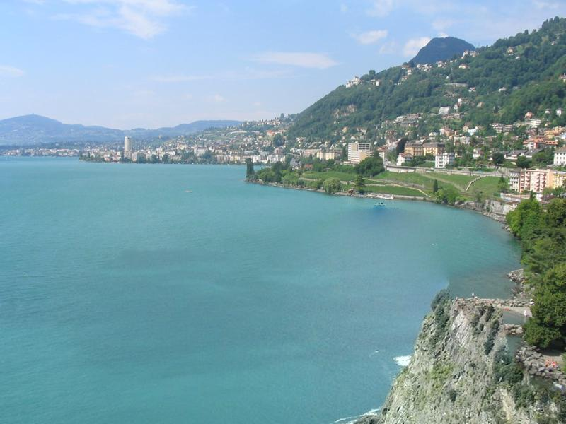
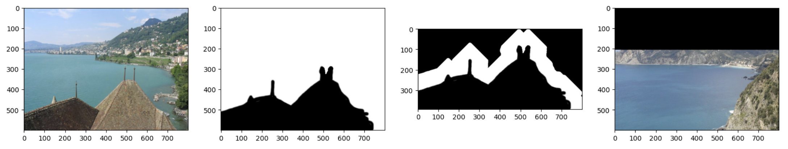
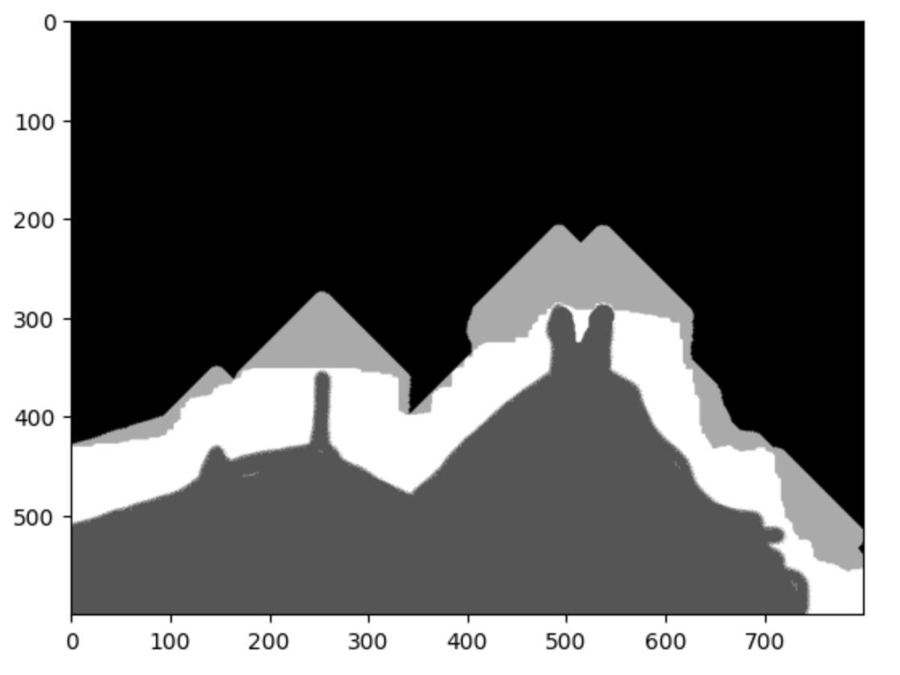
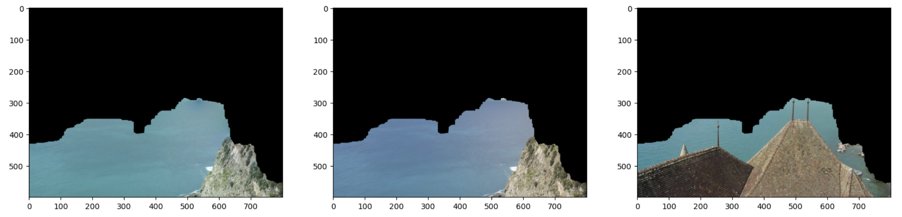
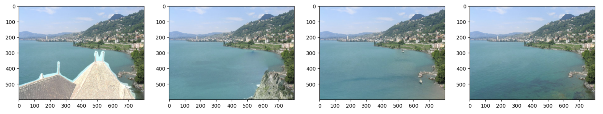
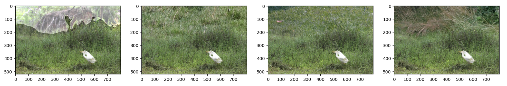
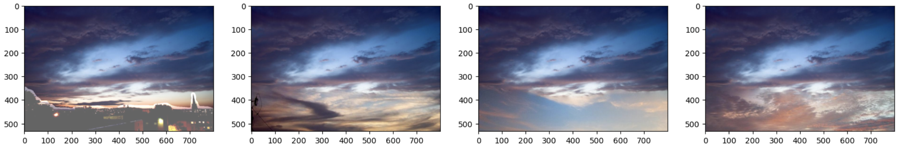
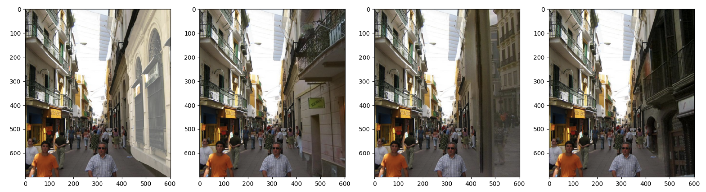
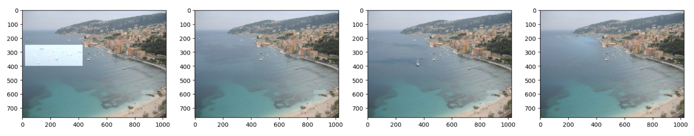

# 基于数据驱动的图像补全

焦景辉 2019013253

## 实现的部分

- 寻找合适的匹配位置：使用计图实现卷积
- 计算融合边界：使用开源库完成 GraphCut
- 自然融合：自主构建泊松融合矩阵、通过开源算法进行矩阵求解

## 代码运行

本次作业我使用 Python 进行实现，实现的依赖全部列在了 `requirements.txt` 这个文件下。运行我的代码需要 Python 版本在 3.7 以上，以及支持 CUDA 的执行。在安装好 Python 和 CUDA 相关的库后，下载安装依赖。

```bash
$ pip install -r requiermemts.txt
```

然后可以执行 `main.py` 来完成基于单个图片的图像补全

```
$ python main.py --help
usage: main.py [-h] --scene SCENE --mask MASK --comp COMP --save SAVE [--vicinity_px VICINITY_PX] [--crop_scale_min CROP_SCALE_MIN]
               [--crop_scale_max CROP_SCALE_MAX]

optional arguments:
  -h, --help            show this help message and exit
  --scene SCENE
  --mask MASK
  --comp COMP
  --save SAVE
  --vicinity_px VICINITY_PX
  --crop_scale_min CROP_SCALE_MIN
  --crop_scale_max CROP_SCALE_MAX
```

比如我们可以通过以下命令完成一组补全

```
$ python main.py 	--mask ./data/input1_mask.jpg
								 	--scene ./data/input1.jpg
								 	--comp ./data/input1/result_img015.jpg
								 	--save ./output/input1/out_05.jpg
```

得到的补全结果如下所示



也可以通过 `batch.py` 完成整个数据集的迁移

```bash
$ python batch.py
```

整个 `output/` 下的结果都是通过这个脚本生成的。

## 算法思路

我实现的算法和作业要求是一致的，基本没有什么不同的地方。由于图片已经给我们准备好了，我也不打算自行收集数据库，因此我实现的算法没有筛选图像的部分。

### 精细匹配

首先在拿到 mask 之后，从 mask 中被遮盖的地方出发开始执行 bfs，标记每个像素位置到达 mask 被遮盖地方的最近距离。当一个位置的距离达到 80 之后，就停止这个位置的扩展。也就是说我们先圈定 mask 周围的一小片区域，在这个区域划定界限，完成融合。这个 80 是论文给出的数值，实际应该根据阴影部分的大小来调整，但是方便起见我们这里就直接使用 80 了。

然后我们需要挑选出补全图片中和圈定的周围这片区域误差最小的地方。这里我们需要注意一个细节就是候选图像的大小可能没有阴影区域大，因此我们需要进行一定的缩放。这里我多次测试之后选择的缩放比例是 0.8 到 1.2，间隔是 0.1。如果缩放比例设置的太大，那么分辨率下降会比较严重，影响最终效果；同时如果范围太宽又回影响运行时间。

然后我们来计算误差，这里根据作业的建议我们直接使用像素差值的平方和来作为误差标准。如果直接手写这个必然是很慢的，因此我使用了 Jittor 的元算子来实现。最后我们挑选误差最小的区域来作为进行后续的处理即可。

如下图所示，左 1 是原图，左 2 是 mask，左 3 的白色部分是 mask 对应的 80 像素的邻域，左 4 是我们挑选后待融合和补全的部分。




### 计算融合边界

在得到粗略的补全部分后，我们需要在邻域上挑选出一个比较优的融合边界。这里我使用了课程上的 GraphCut 来实现，即根据重叠部分的误差建边，然后通过计算最大流得到最小割，即是最优的融合边界。这里我直接使用了 `pymaxflow` 这个包来计算最大流，考虑到在 Python 上手写最大流没有什么意义，因此我没有手动实现。这里因为是平面图，所以可以考虑构建对偶图后用最短路来计算，理论复杂度应该更低。但是实际测试跑最大流已经很快了，因此我也没有实现最短路计算最小割。

继续上面的例子，下图中灰白分界的地方即是我们根据 GraphCut 选择的最优分界线。



### 自然融合

得到最优分界线之后，还不能直接拼接，因为补全图像的颜色和原图可能语义上是匹配的，但是颜色上存在明显差别。因此我们需要调整补全图片的颜色，这里使用柏松融合来计算。这里我们需要根据分割后的部分构建方程，然后求解。具体的公式在课件上，这里就不列举了。

我们构建出来的方程是一个稀疏的系统，这里方便起见我直接使用了 `cupy` 库来求解。这个库基于 CUDA 实现了稀疏线性方程组的求解方法，相比而言调用 JSparse 来重新实现一遍并没有什么意义。因此我直接使用了开源库的实现。因为我们需要针对每个 Channel 分别计算，为了避免反复的上下文切换，我直接把三个 Channel 放到了一个稀疏矩阵里，使用 cupy 来求解。 

对于上面的例子，得到的结果如下。其中最右边是被抹掉的部分，最左边是融合的结果，中间是直接对补全图片进行剪切的结果。可以看出确实颜色根据对应的图像进行了调整，我们在最开始给出的结果也是比较好的。



## 运行结果

在 `output` 目录下是所有结果，其中 `input1` 到 `input4` 是给定的四个图片下补全的结果，`input5` 是我自己给出的。这里我是在 `input1` 中调换了一组图片，选择了一个不同的区域作为新的补全的任务。在我的实现下，单次补全需要运行 40s 左右，其中 10s 是自然融合之前的所有计算，30s 是自然融合求解方程需要的时间。

下面我们分别列出 5 个待补全图片比较好的结果

### 第一张



### 第二张



### 第三张



### 第四张



### 第五张

